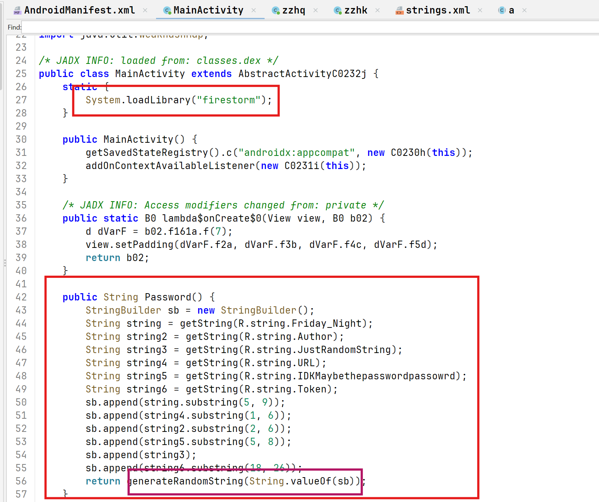
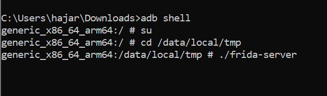
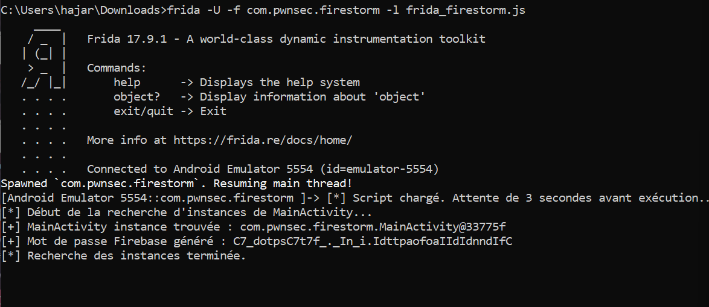
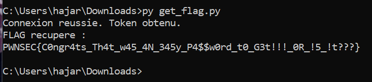
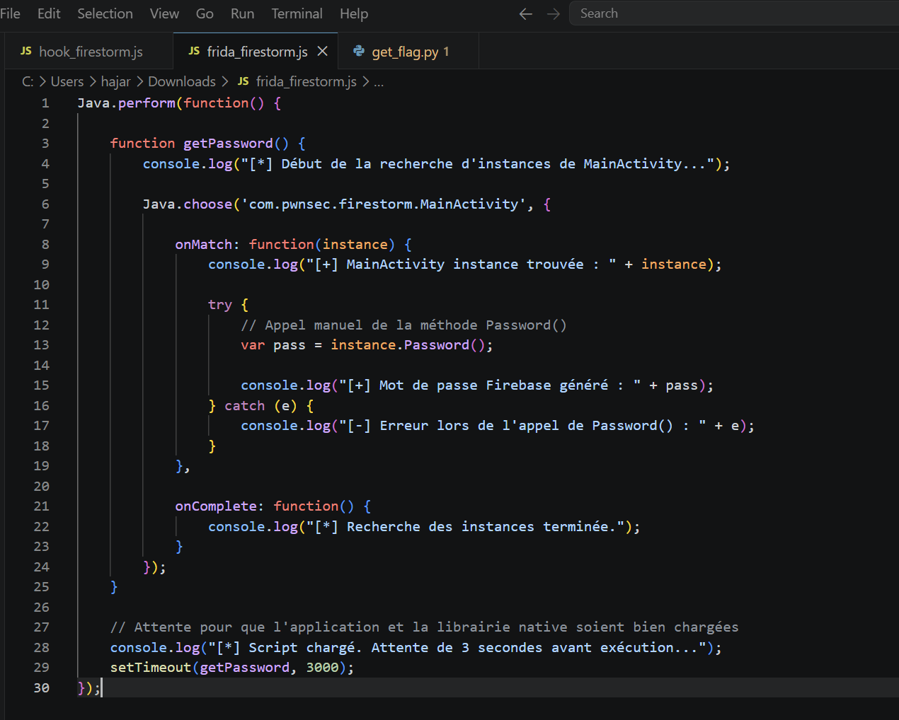

<h1 align="center"> Résolution de l'Exercice 3 : Reverse Engineering Android & Frida</h1>

  
  
  

## 2. Étape  : Analyse Statique (JADX)

À l'aide de **JADX** (décompilateur Java pour Android), nous avons analysé le code source de l'application (`.apk`). 
Nous avons découvert que l'application appelle une fonction Java `Password()` qui s'occupe de construire une chaîne de caractères complexe (`INPUT`). Cette chaîne est formée en concaténant plusieurs morceaux de textes extraits du fichier de ressources `strings.xml`.

  
   
  <em>Figure 1 : Décompilation de la méthode Password() montrant la reconstruction via sous-chaînes.</em>

**Explication de la capture :** 
Sur cette image, on observe la logique Java décompilée par JADX. On voit clairement les appels successifs aux méthodes `.substring()` sur différentes variables extraites des ressources de l'application. C'est cette séquence d'instructions qui nous a permis de comprendre comment la chaîne d'entrée est forgée pièce par pièce avant d'être passée à la fonction native en une seule variable.

###  Reconstruction de la chaîne (INPUT)

La logique décompilée (visible sur la capture) montre l'extraction à l'aide de la méthode `.substring()` :

| Variable source | Logique d'extraction | Résultat | Remarques / Contexte |
| :--- | :--- | :--- | :--- |
| `string` | `substring(5, 9)` | **`"Frid"`** | Extrait des index 5 à 8 (ex: *"It's **Frid**ay..."*) |
| `string4` | `substring(1, 6)` | **`"ttps:"`** | - |
| `string2` | `substring(2, 6)` | **`"7575"`** | - |
| `string5` | `substring(5, 8)` | **`"f.5"`** | - |
| `string3` | `(Valeur convertie)` | **`"or_is_it_random???"`** | Valeur entière convertie ou extraite brute |
| `string6` | `substring(18, 26)` | **`"IsInR5cC"`** | (Portion de la fin de la variable) |

**Le résultat final de la concaténation :**

> `INPUT` = `"Frid"` + `"ttps:"` + `"7575"` + `"f.5"` + `"or_is_it_random???"` + `"IsInR5cC"`  
>  **`INPUT` total = `"Fridttps:7575f.5or_is_it_random???IsInR5cC"`**

Une fois cette chaîne "magique" construite, elle est passée à une fonction **native** nommée `generateRandomString(str)` (contenue dans une librairie dynamique `firestorm.so`). 
**Problème** : Une fonction native (code C/C++ compilé) n'est pas lisible avec JADX. C'est ici que l'analyse dynamique entre en jeu.

---

##  Étape 2 : Analyse Dynamique (Frida)

Pour comprendre ce que fait la fonction `generateRandomString(str)` avec notre `INPUT` sans avoir à faire du reverse engineering lourd sur le binaire Assembleur ARM, nous avons utilisé l'outil d'instrumentation **Frida**.

###  Le Hook (Interception) avec Frida

Frida nous a permis d'injecter du code JavaScript pendant l'exécution de l'application. Notre objectif : **Hooker** (ou intercepter) la fonction native au moment où elle est appelée.

