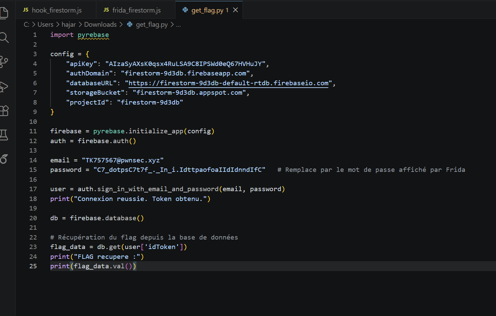

<h1 align="center"> Résolution de LAB 18 : FireStorm</h1>

  
  
  
  

---

##  Introduction
Le but de ce challenge est de récupérer un flag stocké dans une base de données Firebase. L'application mobile utilise une logique complexe pour générer un mot de passe dynamique via une librairie native (`.so`). Nous allons combiner analyse statique et instrumentation dynamique pour contourner cette protection.

## 1. Étape : Analyse Statique (JADX)

À l'aide de **JADX** (décompilateur Java pour Android), nous avons analysé le code source de l'application (`.apk`). 

Nous avons découvert que l'application appelle une fonction Java `Password()` qui s'occupe de construire une chaîne de caractères complexe (`INPUT`). Cette chaîne est formée en concaténant plusieurs morceaux de textes extraits du fichier de ressources `strings.xml`.

  
   
  <em>Figure 1 : Décompilation de la méthode Password() montrant la reconstruction via sous-chaînes.</em>

### Reconstruction de la chaîne (INPUT)
La logique décompilée montre l'extraction à l'aide de la méthode `.substring()` :

| Variable source | Logique d'extraction | Résultat |
| :--- | :--- | :--- |
| `string` | `substring(5, 9)` | **`"Frid"`** |
| `string4` | `substring(1, 6)` | **`"ttps:"`** |
| `string2` | `substring(2, 6)` | **`"7575"`** |
| `string5` | `substring(5, 8)` | **`"f.5"`** |
| `string3` | `(Valeur convertie)` | **`"or_is_it_random???"`** |
| `string6` | `substring(18, 26)` | **`"IsInR5cC"`** |

**INPUT total = `"Fridttps:7575f.5or_is_it_random???IsInR5cC"`**

Une fois cette chaîne construite, elle est passée à une fonction **native** nommée `generateRandomString(str)` contenue dans `firestorm.so`. Le code natif étant complexe à reverser statiquement, nous passons à l'analyse dynamique.

---

## 2. Étape : Analyse Dynamique (Frida)

Pour intercepter le mot de passe final généré par la fonction native, nous utilisons **Frida**.

### A. Préparation de l'environnement
Nous devons d'abord lancer le serveur Frida sur l'émulateur Android avec les privilèges root.

  
   
  <em>Figure 2 : Activation du serveur Frida via ADB shell.</em>

**Explication :** On accède au shell de l'appareil, on passe en `su` (root), on se déplace dans le dossier temporaire où est stocké l'exécutable `frida-server` et on le lance.

### B. Création du script de Hook
Nous avons écrit un script JavaScript (`frida_firestorm.js`) pour forcer l'appel de la méthode `Password()` et afficher son résultat.

  
   
  <em>Figure 3 : Code source du script d'instrumentation.</em>

**Logique du script :**
- On utilise `Java.choose` pour trouver une instance active de `MainActivity`.
- On appelle manuellement la méthode `instance.Password()`.
- On intercepte et affiche la valeur de retour (qui est le mot de passe Firebase généré).

### C. Exécution et interception
En exécutant Frida avec notre script, nous récupérons le mot de passe "clair" généré par la librairie native.

  
   
  <em>Figure 4 : Terminal affichant le mot de passe Firebase généré.</em>

**Résultat intercepté :**  
`C7_dotpsC7t7f_._In_i.IdttpaofoaIIdIdnndIfC`

---

## 3. Étape : Exploitation Finale (Accès Firebase)

Avec ce mot de passe et l'email trouvé dans les ressources (`TK757567@pwnsec.xyz`), nous pouvons nous connecter à la base de données Firebase pour lire le flag.

### A. Script Python de récupération
Nous utilisons la bibliothèque `pyrebase` pour simuler la connexion de l'application mobile.

  
   
  <em>Figure 5 : Script Python utilisant les identifiants récupérés.</em>

### B. Obtention du Flag
L'exécution du script nous donne un accès direct à la donnée sensible stockée en base.

  
   
  <em>Figure 6 : Connexion réussie et extraction du Flag.</em>

** FLAG TROUVÉ :**  
`PWNSEC{C0ngr4ts_Th4t_w45_4N_345y_P4$$w0rd_t0_G3t!!!_0R_!5_!t???}`

---

##  Conclusion
Ce lab démontre l'efficacité de l'instrumentation dynamique avec **Frida**. Même si une partie de la logique est cachée dans du code natif (`C/C++`), le fait de pouvoir manipuler les instances Java en mémoire permet de récupérer les secrets (clés, mots de passe) juste avant leur utilisation.
